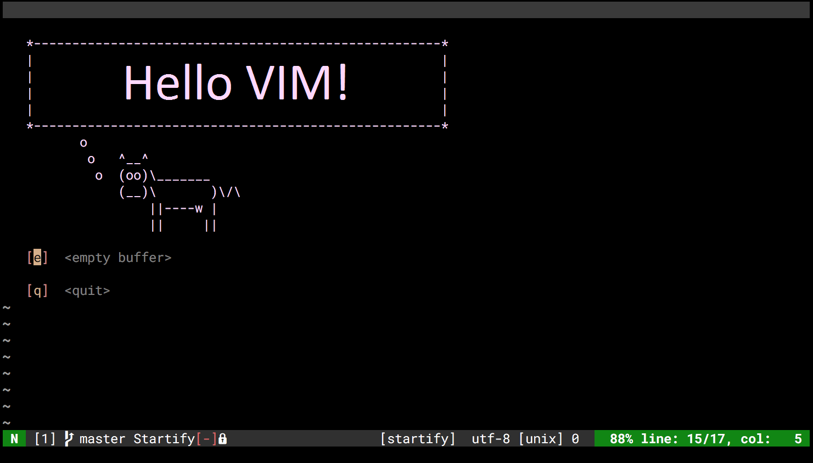

# My VIM configuration
There is my vim configuration.


## Installation
### Windows
It is necessary to have the same architectures (32 or 64 bits) for python and vim. It is better to install python 2.7 and 3.5.
#### FZF
See installation guide [here](https://github.com/junegunn/fzf#windows). Download pre-built binaries and add path to it in `PATH` variable.
#### Omnysharp
For enable msbuild add to path variable path to .NET framework. For example: 
`C:\Windows\Microsoft.NET\Framework\v4.0.30319`
#### YouCompleteMe
Install all dependencies. See [here](https://github.com/Valloric/YouCompleteMe#windows).

## Configuration
Configuration files are in the ***configs/*** directory. I divided all my configuration files on two groups: ***common*** and ***plugins***. In ***common/*** directory are the files that controls common behavior of VIM. In ***plugins/*** are configuration files for all installed plugins. Both of these directories are included file ***conf.vimrc***. This file determine which configurations should be loaded.

### Common configurations
* *common.vimrc*

  This file included common settings of VIM such as:
  * Enabling filetype detection
  * Configuration of files encryption
  * Search settings
  * and etc.
* *common-functions.vimrc*

  This file included some VimScript functions that can be useful for VIM configuring.
* *file-association.vimrc*

  Here is determined settings for associating different  filename extensions with special filetype.
* *key-bindings.vimrc*

  In this file are VIM key bindings. I remapped leader key to `,`.
* *statusline.vimrc*

  This file included my configuration for status line. I don't like to use something like *powerline* or *airline* because it increases launch time of VIM.

### Plugins configurations
This directory is included all plugin configurations. Below it is some links where I have found information about some plugins configuration.
#### Latex
For configuration I used this article: https://coderwall.com/p/s1i5pw/latex-with-vim
#### YouCompleteMe
1. Global YCM Config: https://jonasdevlieghere.com/a-better-youcompleteme-config/

## Known issues:
### Mac OS:
Had a problem with installation ***YouCompleteMe*** and got the following error:
```
$ xz clang+llvm-4.0.0-x86_64-apple-darwin.tar.xz

dyld: Library not loaded: /Library/Frameworks/Mono.framework/Versions/4.0.5/lib/libintl.8.dylib
Referenced from: /Applications/Unity/MonoDevelop.app/Contents/Frameworks/Mono.framework/Versions/Current/bin/xz
Reason: image not found
```
The solution is: remove this binary file and install `xz`

### Misc.:
Found fix for vim background [here](https://sunaku.github.io/vim-256color-bce.html)

Status line configuration I found [here](https://gabri.me/blog/diy-vim-statusline) and [here](http://vim.wikia.com/wiki/Change_statusline_color_to_show_insert_or_normal_mode).

Information about colors I found [here](http://vim.wikia.com/wiki/Xterm256_color_names_for_console_Vim) and [here](https://upload.wikimedia.org/wikipedia/en/1/15/Xterm_256color_chart.svg).

## Try the following plugins
### View
https://github.com/severin-lemaignan/vim-minimap

https://github.com/jaxbot/semantic-highlight.vim

https://github.com/junegunn/limelight.vim

### Programming
https://github.com/python-mode/python-mode

https://github.com/metakirby5/codi.vim

https://github.com/w0rp/ale

https://github.com/devjoe/vim-codequery

https://github.com/rhysd/committia.vim

### Spell checking
https://opensource.com/article/17/2/vim-plugins-writers

https://github.com/rhysd/vim-grammarous

https://github.com/reedes/vim-wordy

https://github.com/dbmrq/vim-ditto

https://github.com/dpelle/vim-LanguageTool

### Plugins for VIM development
https://github.com/mhinz/vim-lookup

https://github.com/tweekmonster/helpful.vim

https://github.com/tpope/vim-scriptease

https://github.com/amoffat/snake

https://github.com/junegunn/vader.vim

### Other
https://github.com/justinmk/vim-gtfo

